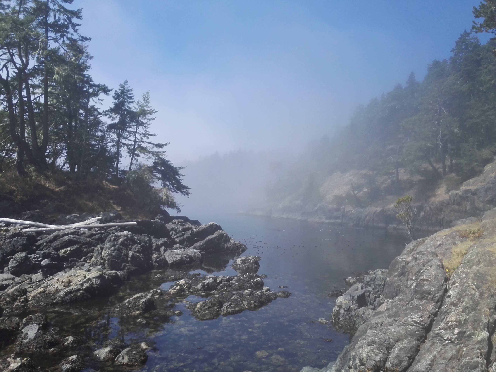
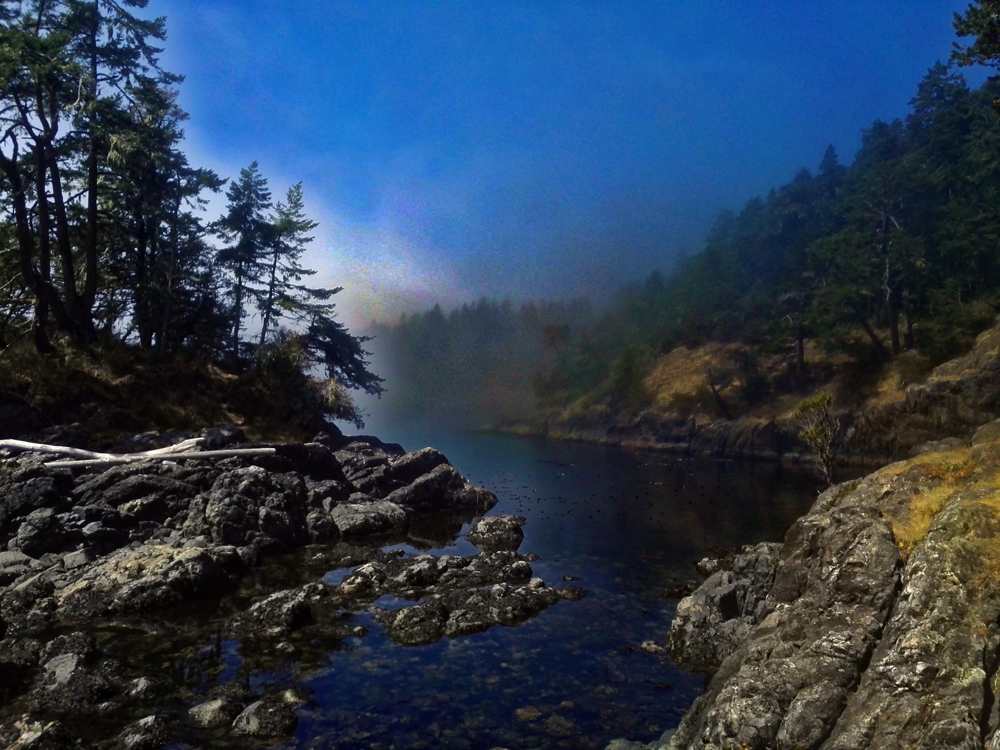
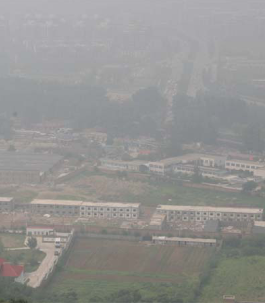
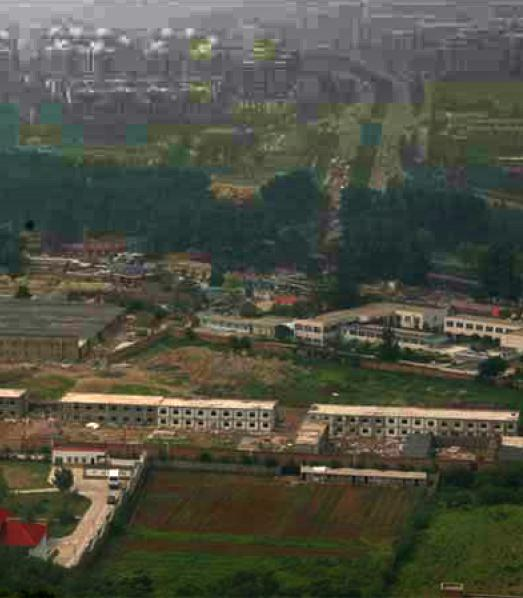

# Haze Removal

## Introduction

This is an simple implemention of "single image haze removal using dark channel prior" by kaiming He, which wins the CVPR09 best paper.

## Parameters by default
- radius=7
- omega=0.95
- t0=0.1
- r=60
- eps=0.001

## Dependencies

- numpy
- opencv-python
- scikit-image
- Pillow
- matplotlib
- numba

## Run

```bash or zsh
cd Haze_Removal_python
python haze_removal.py 
```
You should modify the 'image' in haze_removal.py according to your own testset

## DEMO

<figure class="half">
    
    
</figure>

<figure class="half">
    
    
</figure>

According to two of the dehazing images, there are still some artifacts and distortions. And when the intensity of the haze image is close to the atmosphere light, the algorithm didn't work well.

## References
   
- paper: Single Image Haze Removal using Dark Channel Prior
- paper: Guided Image Fltering
